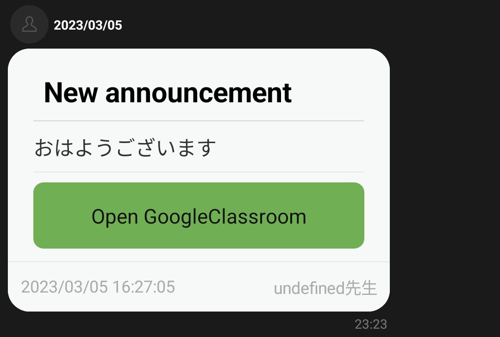
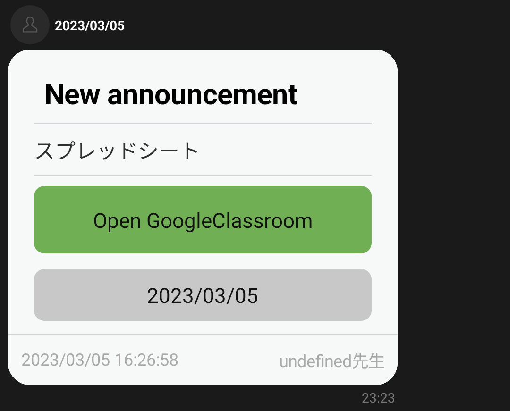
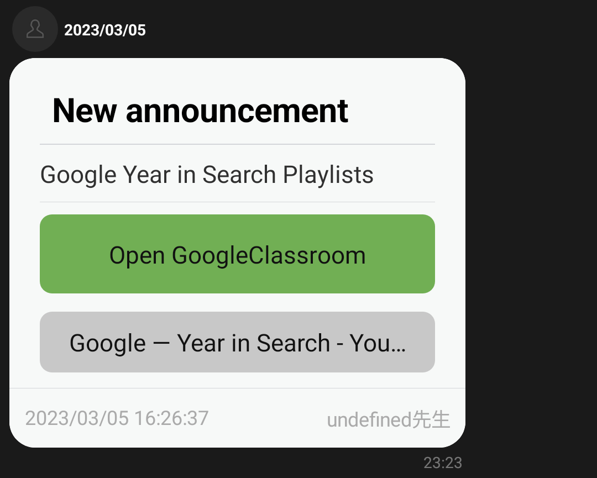
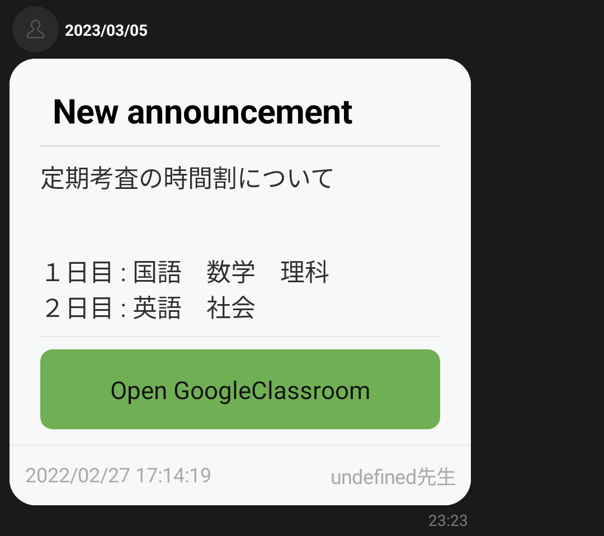
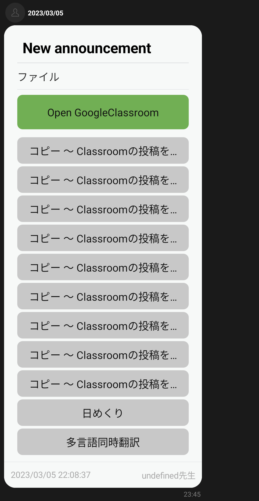
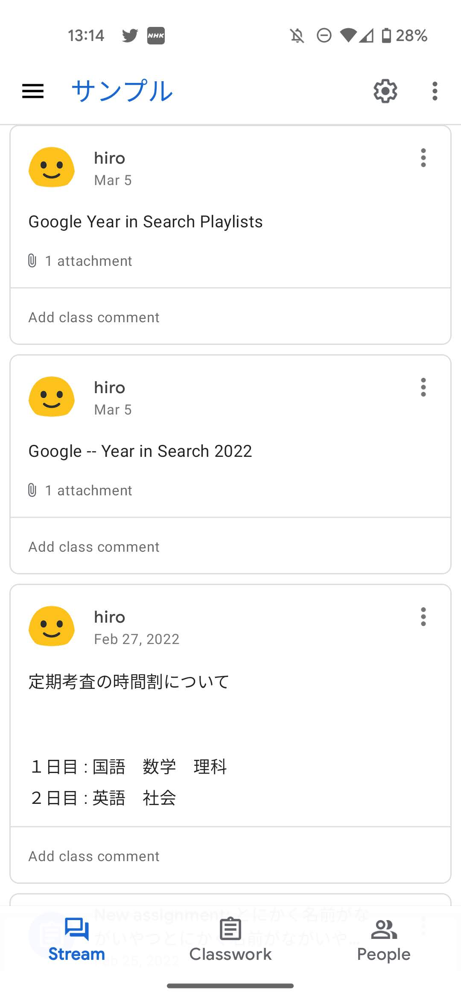

## 概要
Google Classroomの投稿をLINEグループに転送するスクリプトです。  
公式アカウントの友達全員に投稿することもできます。  

## 注意点
- Google Formのリンクからフォームを回答すると課題の完了マークが付きません。
- アーカイブされたクラスでは実行できません。(投稿の取得ができない)
- LINE公式アカウントに投稿制限があります。制限に達すると投稿されなくなるので注意してください。
  詳しくは[LINE Developer](https://developers.line.biz/ja/reference/messaging-api/#rate-limits)を参照してください。  
- [Google Apps Script リファレンス](https://developers.google.com/apps-script/reference?hl=ja)

## 手順
1 [このリンク](https://docs.google.com/spreadsheets/d/1e5lGeoflQq8qsiCUAmHgwl-7v-81htjkDEXGZUXkn-0/copy)をクリックしコピーを作成  
2 スプレッドシートの`拡張機能`タブから`Apps Script`をクリックしスクリプトを開く  
3 Apps Scriptの右上`デプロイ`をクリックし、`新しいデプロイ`
4 種類の選択から`ウェブアプリ`を選び、アクセスできるユーザーを`全員`に変更して`デプロイ`をクリック  
5 `詳細`(左側に小さくあります)をクリックし`Classroom の投稿を LINE に転送する (安全ではありません) に移動`をクリック  
6 一番下の`許可`をクリック  
7 `ウェブアプリのURL`をコピー  
8 作ったLINE公式アカウントのMessaging API設定のWebhook URLに貼り付け、Webhookの利用を`ON`にする  
    (検証すると`成功`が表示されるはずです。)  
9 一番下から`チャンネルアクセストークン`を発行しコピーし、Apps Scriptの`grobal_vareables.js`の`LINE_CHANNEL_ACCESS_TOKEN`の`""`の中に貼り付ける  
10 LINEグループでなにか送信する  
11 スプレッドシートの`LINE_GROUP_ID`タブの`A1`セルに表示されている`LINE_GROUP_ID`をコピーし、Apps Scriptの`grobal_vareables.js`の`LINE_GROUP_ID`の`""`の中に貼り付ける  
12 Apps Scriptの`get_courses.gs`を開き``getCourseList`を選び実行  
    (クラス名 (COURSE_ID)が表示されます。)  
13 転送したいクラスのCOURSE_IDをコピーし、Apps Scriptの`grobal_vareables.js`の`COURSE_ID`の`""`の中に貼り付ける  
14 実行し、LINEグループに課題が投稿されることを確認  

## 投稿の説明
左上は`New assignment`、`New announcement`、`New materials`のいずれかです。  
その下に内容やリンクが表示されます。  
フッターには投稿日時と投稿者が表示されます。  

## 参考画像
名前が`undefind先生`になっているのは、この先生の姓がないからです。姓があれば正しく表示されます。  

  
  
  
  

ファイルが複数ある場合  
  

Google Clasroomのスクリーンショット  
  