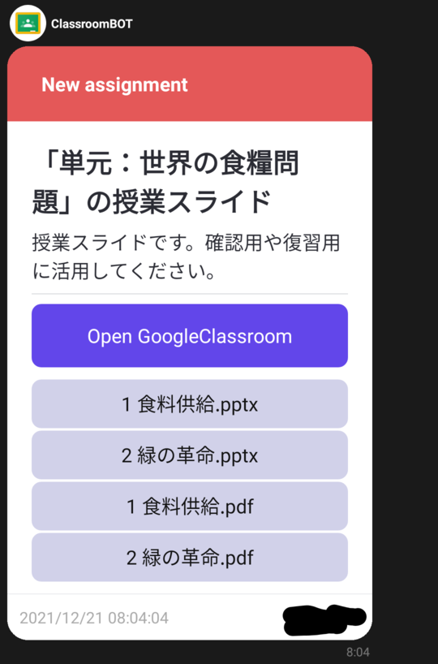
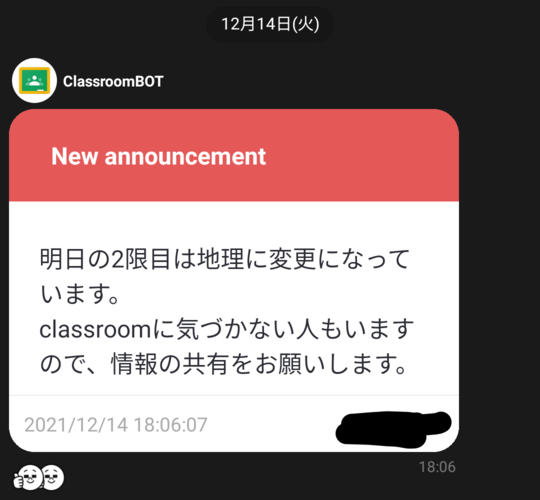

# Classroom の投稿を LINE に転送する BOT について

## Google で調べてわかったこと

- API(アプリとアプリを繋ぐツール(今回は Google Classroom と LINE))
- 記事が 1 件しかない 【GAS】Google Classroom の投稿を LINE に転送(https://qiita.com/kashu02/items/1532c4b548e560eea21b)  
  (自分でカスタマイズしたいと思った。)

以上のことから自分で作成した。

## 概要

Classroom の投稿を LINE に転送する BOT(LINE 公式アカウント)を GoogleAppsScript・Google Classroom API・LINE API を用いて作成した。
BOT の投稿例は最後にある。

## 実装理由

- Classroom の読み込みに時間がかかるため使い勝手が悪いから。
- 通知送信も可能だが、スルーしてしまう可能性があり、重要な連絡に気付けないから。
- 通知に気づけなかったことにより不当な利益を被ることがあるから。
- パソコンがあれば作れるため上記のような理由で困っている人の役に立つから。
- 日本では LINE の利用率が非常に高いため、LINE BOT にした。

## 利用したサービスについて

- Google Classroom API (https://developers.google.com/classroom)  
  Classroom の投稿を取得するための API。
- Google Apps Script (https://workspace.google.co.jp/intl/ja/products/apps-script/)  
  簡単に言うと「Google 版 VBA」。Javascript で書け、Google のサービスが使いやすく、トリガー（定期実行）を簡単に設定できる。
- Google Spreadsheet (https://www.google.com/intl/ja_jp/sheets/about/)  
  簡易的なデータベースとして使用
- LINE Messaging API (https://developers.line.biz/ja/services/messaging-api/)  
  LINE に送信するときに使用する API。

## 仕組み

## 実装について

- GCP(https://console.cloud.google.com/?hl=ja) が使えない(学校のアカウントでの使用制限)ので GoogleAppsScript を使用。
- 公式アカウント化しているが、僕自身の Classroom の投稿が転送され、セキュリティ面でも問題がある(Classroom に個人的なことが投稿される可能性がある)。そのため、公式アカウントの公開は微妙だが、あるグループで導入している。また LINE 公式アカウントが無料で投稿できるメッセージ件数に制限があるため大人数の LINE グループには資金的な面で導入できない。

## コードについて

[/code](code)

## 実装した結果

- 実質的に Classroom を見る機会が増え、「Classroom 見るの忘れた 😥」ということも無くなった。
- Classroom を見る手間も減り、楽になった。

## 改善したい点

- LINE のトーク画面での検索機能が BOT の投稿には対応していないから、検索できない点。(LINE の仕様なのでどうしようもない)

## 投稿例

