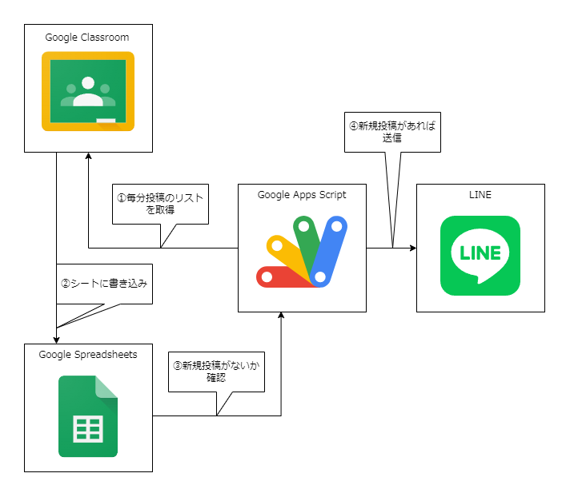

# 詳しい人向け

## 仕組み

すべての投稿（課題・資料・通知）がSpreadsheetにそれぞれシート別に書き込まれます（投稿日時順 : 古 → 新）。その後、`sent or not`の列をもとに投稿済みかどうか判断し、投稿済でない場合、投稿され`sent or not`の列に`sent`が書き込まれます。

## 設定すること

global_vareablesで
- `LINE_CHANNNEL_ACCESS_TOKEN`
- `COURSE_ID`
- `actionPer1minuite()`を時間主導型でトリガー設定

## 注意点

- 初回設定時、自分で`sent or not`の列に`sent`を書き込まないと、多数の投稿が一度に転送され**メッセージ通数を多数消費する**可能性があります。
